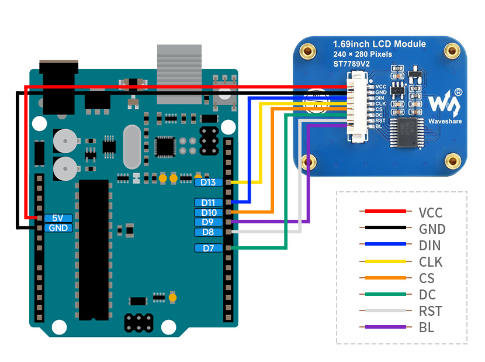

# C Library for ST7789 1.69 TFT LCD display

## ST7789 Description
Detailed information are described in [Datasheet ST7789V2](https://m5stack.oss-cn-shenzhen.aliyuncs.com/resource/docs/datasheet/unit/lcd/ST7789V2_SPEC_V1.0.pdf).
Initialization is the same as for ST7735 driver.

## Library
C library is aimed for driving 1.69 TFT LCD display 320x240 with ST7789 driver through SPI's Atmega328P / Atmega8.

### Versions
- **1.0** - the first publication, init sequence and basic functions like draw line, clear screen, draw char, draw string.

### Initialization
```
// +---------------------------+
// |        Power UP           |
// +---------------------------+
// |      delay >  10ms        |
// +---------------------------+
//              |
// +---------------------------+
// |   Software Reset / 0x01   |
// +---------------------------+
// |       no argument         |
// |      delay > 120ms        |
// +---------------------------+
//              |
// +---------------------------+
// |    Sleep Out / 0x11       |
// +---------------------------+
// |       no argument         |
// |      delay > 120ms        |
// +---------------------------+
//              |
// +---------------------------+
// |    Display On / 0x29      |
// +---------------------------+
// |       no argument         |
// |      delay > 120ms        |
// +---------------------------+
```

## Hardware connection MICROCONTROLLER -> LCD
Library was tested with **ST7789 1.69″ TFT Display** and **Arduino UNO R3**. Arduino have not installed bootloader, it was raw Atmega328P microcontroller.
Communication was done through SPI port interface of Arduino UNO R3. This hardware configuration was chosen for simplicity.
| PORT LCD | PORT ATMEGA328P | ARDUINO UNO R3 | Description |
| :--- | :--- |  :--- | :--- |
| UCC | +5V | +5V | Supply Voltage +5V |
| GND | GND | GND | Ground |
| DIN | PB3 | D11 | SPI Serial data in / MOSI |
| CLK | PB5 | D13 | SPI Serial clock signal |
| CS | PB2 | D10 | SPI Chip Select |
| DC | PD7 | D7 | SPI data / command; 1=Data, 0=Command |
| RST | PB0 | D8 | Chip Reset Signal |
| BL | PB1 | D9 | Backlight control |

### Picture of hardware connection


### Usage & Tested
Library was tested and verified with **_ST7789 1.69″ TFT Display_** and **_Atmega328P_**. It can be used for MCU Atmega8 too because of the similarity with Atmega328P.

## Demonstration

## Links
- [Datasheet ST7789](https://m5stack.oss-cn-shenzhen.aliyuncs.com/resource/docs/datasheet/unit/lcd/ST7789V2_SPEC_V1.0.pdf)
- [Hardware connection](https://www.elecom.sk/sk/1-69inch-lcd-display-module-240-280-resolution-spi-interface-ips-262k-colors.html?cnid=95cb7bd85f6306d486d3e6f45598f&)
